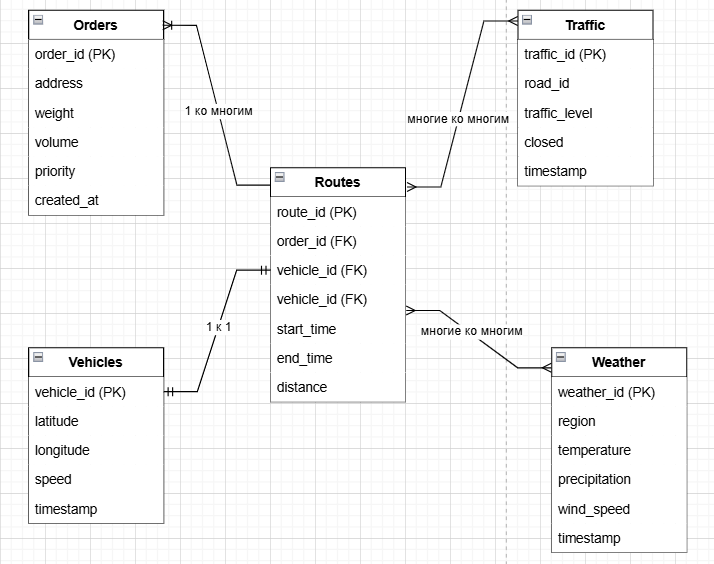

# Отчет по разработке модели данных для проекта оптимизации маршрутов доставки на основании ДЗ.2 и Д3.3

## 1. Введение
В рамках проекта оптимизации маршрутов доставки необходимо разработать модель данных, которая будет поддерживать сбор, хранение и обработку данных из различных источников, таких как заказы, GPS-данные, погода и трафик. Модель данных должна быть масштабируемой, гибкой и поддерживать как аналитические запросы, так и потоковую обработку данных.

## 2. Концептуальная модель данных
Концептуальная модель данных описывает основные сущности и их взаимосвязи без углубления в технические детали. Основные сущности:
- **Заказы**: Информация о заказах, включая адрес доставки, вес, объем и приоритет.
- **Транспорт**: Данные о транспортных средствах, включая их текущее местоположение и скорость.
- **Погода**: Данные о погодных условиях в различных регионах.
- **Трафик**: Информация о загруженности дорог и пробках.
- **Маршруты**: Оптимизированные маршруты для доставки заказов.

## 3. Логическая модель данных
Логическая модель данных детализирует концептуальную модель, определяя атрибуты сущностей и их типы данных. Основные таблицы:

### Таблица `Orders`:
- `order_id` (Primary Key)
- `address`
- `weight`
- `volume`
- `priority`
- `created_at`

### Таблица `Vehicles`:
- `vehicle_id` (Primary Key)
- `latitude`
- `longitude`
- `speed`
- `timestamp`

### Таблица `Weather`:
- `weather_id` (Primary Key)
- `region`
- `temperature`
- `precipitation`
- `wind_speed`
- `timestamp`

### Таблица `Traffic`:
- `traffic_id` (Primary Key)
- `road_id`
- `traffic_level`
- `closed`
- `timestamp`

### Таблица `Routes`:
- `route_id` (Primary Key)
- `order_id` (Foreign Key)
- `vehicle_id` (Foreign Key)
- `start_time`
- `end_time`
- `distance`

## 4. Взаимосвязи между сущностями

### 4.1. **Заказы и Маршруты**
- **Связь**: **1 ко многим** (1 маршрут может содержать несколько заказов).
- **Описание**: 
  - Каждый заказ (`Orders`) связан с определенным маршрутом (`Routes`) через внешний ключ `order_id` в таблице `Routes`.
  - Один маршрут может включать несколько заказов, но каждый заказ принадлежит только одному маршруту.
- **Пример**: 
  - Маршрут с `route_id = 1` может включать заказы с `order_id = 101`, `order_id = 102`.

### 4.2. **Транспортные средства и Маршруты**
- **Связь**: **1 к 1** (одно транспортное средство может быть назначено на один маршрут).
- **Описание**:
  - Каждое транспортное средство (`Vehicles`) связано с маршрутом (`Routes`) через внешний ключ `vehicle_id` в таблице `Routes`.
  - Одно транспортное средство может быть назначено только на один маршрут в конкретный момент времени.
- **Пример**:
  - Транспортное средство с `vehicle_id = V001` может быть назначено на маршрут с `route_id = 1`.

### 4.3. **Маршруты и Погода**
- **Связь**: **Многие ко многим** (условия погоды могут влиять на несколько маршрутов, и один маршрут может зависеть от нескольких погодных условий).
- **Описание**:
  - Данные о погоде (`Weather`) могут влиять на несколько маршрутов (`Routes`), и один маршрут может зависеть от нескольких погодных условий (например, дождь, снег, ветер).
  - Для реализации этой связи может потребоваться промежуточная таблица, например, `Route_Weather`, которая будет связывать маршруты и погодные условия.
- **Пример**:
  - Погодные данные с `weather_id = W001` (дождь в Москве) могут повлиять на маршруты с `route_id = 1` и `route_id = 2`.

### 4.4. **Маршруты и Трафик**
- **Связь**: **Многие ко многим** (условия трафика могут влиять на несколько маршрутов, и один маршрут может зависеть от нескольких условий трафика).
- **Описание**:
  - Данные о трафике (`Traffic`) могут влиять на несколько маршрутов (`Routes`), и один маршрут может зависеть от нескольких условий трафика (например, пробки на разных дорогах).
  - Для реализации этой связи может потребоваться промежуточная таблица, например, `Route_Traffic`, которая будет связывать маршруты и условия трафика.
- **Пример**:
  - Трафик с `traffic_id = T001` (пробка на дороге `R001`) может повлиять на маршруты с `route_id = 1` и `route_id = 3`.

### 4.5. **Транспортные средства и Водители**
- **Связь**: **1 к 1** (один водитель управляет одним транспортным средством).
- **Описание**:
  - Хотя в текущей модели данных явно не указана таблица для водителей, можно предположить, что каждый водитель связан с конкретным транспортным средством (`Vehicles`).
  - Один водитель управляет одним транспортным средством, и одно транспортное средство закреплено за одним водителем.
- **Пример**:
  - Водитель с `driver_id = D001` может быть назначен на транспортное средство с `vehicle_id = V001`.

## 5. Физическая модель данных
Физическая модель данных описывает реализацию модели в конкретной СУБД. Для проекта выбрана комбинация **PostgreSQL** для структурированных данных и **AWS/HDFS** для хранения сырых данных (GPS-данные, логи).
 
## 6. Заключение
Разработанная модель данных поддерживает сбор, хранение и обработку данных из различных источников, обеспечивая гибкость и масштабируемость. Использование комбинации PostgreSQL и AWS/HDFS позволяет эффективно управлять как структурированными, так и сырыми данными, что критично для проекта оптимизации маршрутов доставки.

---

### Приложение 1: Визуализация связей
Для визуализации связей можно использовать инструмент **diagrams.net (draw.io)**. Ниже приведен пример структуры таблиц и их связей:

Оригинальный файл для просмотра в diagrams.net (draw.io)
[Logic model.drawio](Logic%20model.drawio)

