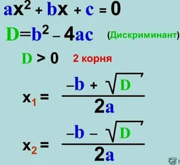

**Задача 1. Вычисление корней квадратного уравнения**

Напишите программу, которая:
- Запрашивает у пользователя коэффициенты квадратного уравнения (a, b, c) (тип float).
- Вычисляет дискриминант по формуле: см. скриншот
- Вычисляет корни уравнения по формулам (будем считать, что дискриминант всегда больше 0): : см. скриншот
- Выводит результат.
(подсказка – корень можно реализовать с помощью возведения в степень)

**Задача 2: Вычисление суммы и произведения цифр числа**
Напишите программу, которая:
- Запрашивает у пользователя трёхзначное число (тип int).
- Вычисляет сумму и произведение его цифр.
- Выводит результат.

**Задача 3. Доступ в систему**
Условие:
Пользователь может получить доступ к системе, если:
Он ввёл правильный логин И правильный пароль
ИЛИ У него есть специальный токен доступа

Что должна сделать программа:
- Запрашивает у пользователя 3 значения (необходимо определить самостоятельно по заданному условию, тип bool) пример:
login_correct = ….(input("Правильный логин? (True/False): "))
(вместо точек нужно сделать приведение типа)
- Вывести, есть ли у пользователя доступ по введенным значениям

**Задача 4: Проверка доступа к контенту с учётом блокировки**
Условие:
Пользователь может получить доступ к контенту, если:
Он подписан на платную подписку И его возраст больше 18 лет 
ИЛИ Он является администратором. 
А так же ко всем условиям добавить проверку на: Заблокирован ли его аккаунт (он не должен быть заблокированным чтобы получить доступ + заблокированным может быть даже админ)

Что должна сделать программа:
- Запрашивает у пользователя 4 параметра – определить их и их тип нужно самостоятельно
- Вывести, есть ли у пользователя доступ по введенным значениям